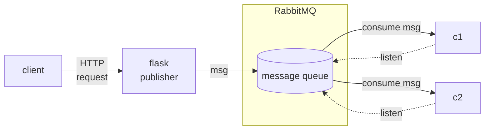

# Pub-sub sandbox
- [Pub-sub sandbox](#pub-sub-sandbox)
  - [Abstract](#abstract)
  - [Architecture](#architecture)
  - [Running instructions](#running-instructions)
    - [RabbitMQ setup](#rabbitmq-setup)
    - [Publisher setup](#publisher-setup)
    - [Consumer setup](#consumer-setup)

## Abstract
This is a simple sandbox project to tryout pub-sub RabbitMQ functionality.
## Architecture
The whole functionality is based on the following concept/architecture:
- RabbitMQ message broker - responsible for queueing the messages
- Flask based message publisher - listening for requests on 5000 port, publishing the http requests bodies to the message RabbitMQ broker
- Celery based message consumer(s) - reading the messages from the RabbitMQ broker queue, you can create as many consumers as you want and observe how they fight to consume the messages ;)



## Running instructions
If you want to try out the code - the easiest way is to run it in dockerized form.
### RabbitMQ setup
```sh
$ docker network create rabbits

$ docker run -d --rm --net rabbits --hostname rabbit-1 --name rabbit-1 -p 5672:5672 -p 15672:15672 rabbitmq:3.11-management

$ docker exec -it rabbit-1 bash
```
### Publisher setup

```sh
$ cd applications/publisher

$ docker build -t prophet/publisher .

$ docker run -it --rm -e RABBIT_HOST=rabbit-1 -e RABBIT_PORT=5672 -e RABBIT_USERNAME=guest -e RABBIT_PASSWORD=guest -e RABBIT_QUEUE=task_queue --net rabbits --name flask-publisher -p 5000:5000 prophet/publisher 
```

### Consumer setup

```sh
$ cd applications/consumer 

$ docker build -t prophet/consumer .

$ docker run -it --rm -e RABBIT_HOST=rabbit-1 -e RABBIT_PORT=5672 -e RABBIT_USERNAME=guest -e RABBIT_PASSWORD=guest -e RABBIT_QUEUE=task_queue --net rabbits --name consumer prophet/consumer 
```